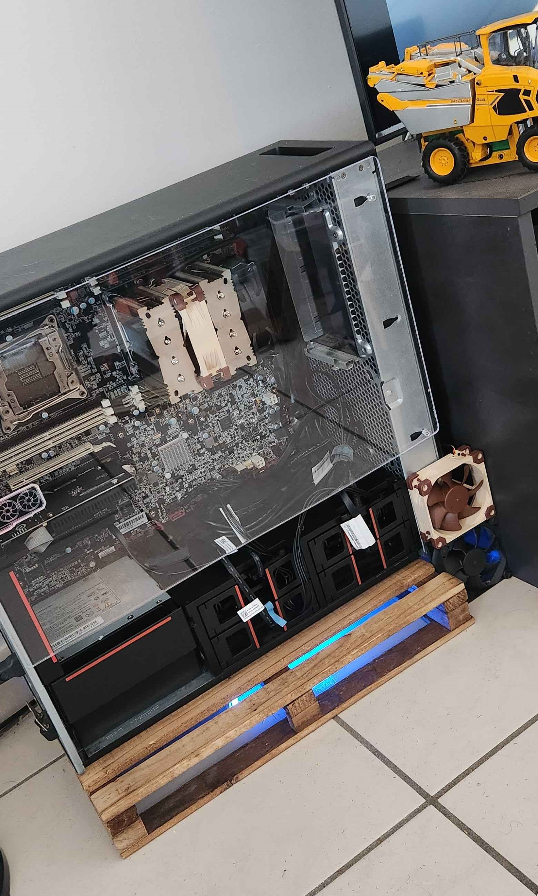
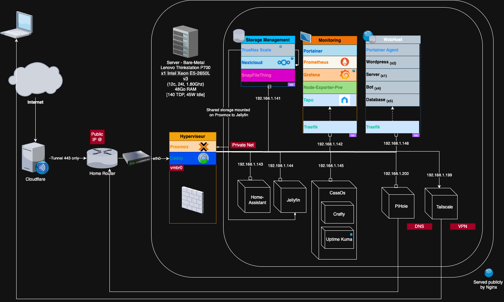

# HomeLab Configuration

This repository contains the configuration for my home lab. It's running under Proxmox VE 8.2.4
It's also a way for me to document my setup and be able to recreate it if needed, with all the helpfull commands and ressources (doc, videos) I used.

## Schema

> Last update: October 2025

## Server Configuration

- **Server**: Lenovo ThinkStation P700
- **CPU**: 1x Intel Xeon E5-2650L v3 @ 24x1.80GHz
- **RAM**: 48GB DDR4 ECC
- **Storage**: 1x 256GB SSD + 3x 1TB Samsung 860 EVO SSD
- **Network**: 2x 1Gbps Ethernet
- **Power**: 700W Platinum PSU
- **TDP**: 135W
- **Idle Power**: 45W
- **OS**: Proxmox VE 8.2.4
